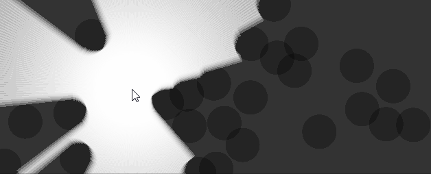

### Overview

This crate hopes to provide an efficient 2D space partitioning data structure and useful query algorithms to perform on it in a hopefully simple cohesive api.
It is a hybrid between a [KD Tree](https://en.wikipedia.org/wiki/K-d_tree) and [Sweep and Prune](https://en.wikipedia.org/wiki/Sweep_and_prune).
Uses `no_std`, but uses the `alloc` crate.
Please see the [dinotree-book](https://dinotree-book.netlify.com) which is a work in-progress high level explanation and analysis of this crate.

### Inner projects

The dinotree_alg_demo inner project is meant to show case the use of these algorithms. 

### Analysis

Please see the [book](https://dinotree-book.netlify.com) for a work in progress writeup of the design and analysis of the algorithms in this project.

### Screenshot

Screen capture from the inner dinotree_alg_demo project.



### Example

```rust
use axgeom::rect;
use dinotree_alg::*;

fn main() {
    let mut aabbs = [
        bbox(rect(0isize, 10, 0, 10), 0),
        bbox(rect(15, 20, 15, 20), 0),
        bbox(rect(5, 15, 5, 15), 0),
    ];

    //Create a layer of direction.
    let mut ref_aabbs = aabbs.iter_mut().collect::<Vec<_>>();

    //This will change the order of the elements in bboxes,
    //but this is okay since we populated it with mutable references.
    let mut tree = DinoTree::new(&mut ref_aabbs);

    //Find all colliding aabbs.
    tree.find_intersections_mut(|a, b| {
        *a += 1;
        *b += 1;
    });

    assert_eq!(aabbs[0].inner, 1);
    assert_eq!(aabbs[1].inner, 0);
    assert_eq!(aabbs[2].inner, 1);
}

```
